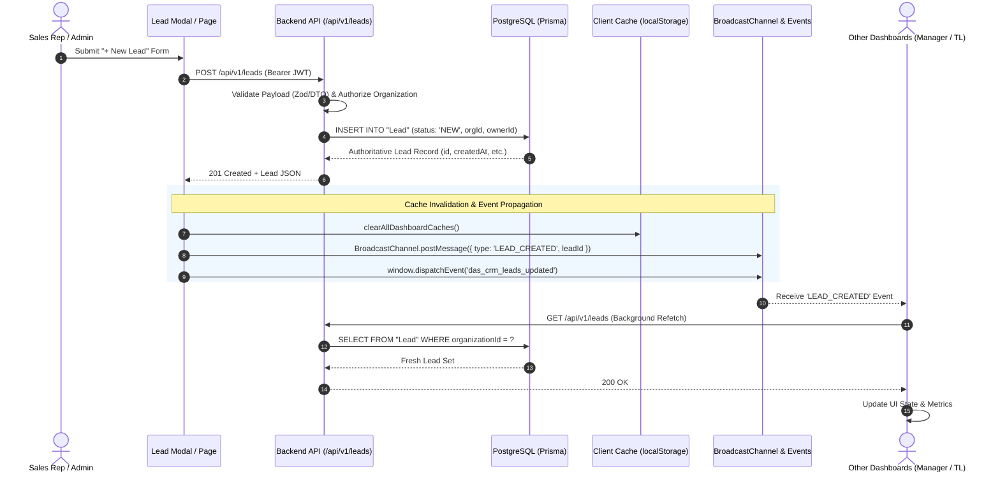
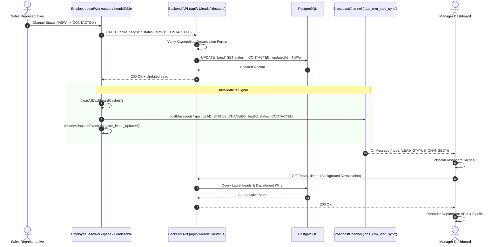
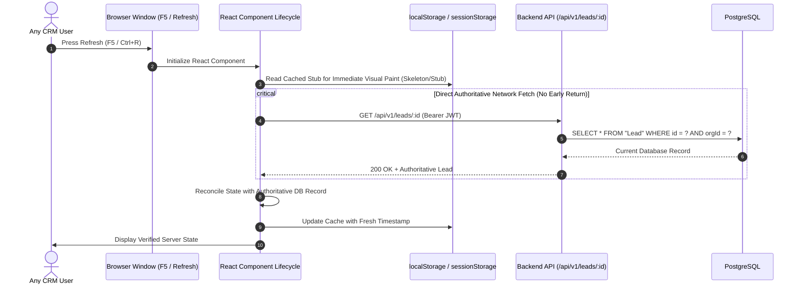

# 🏛️ DAS CRM — Authoritative System Architecture & Data Consistency Specification

> **Core System Tenet**: **PostgreSQL is the single authoritative source of truth for all business data.**  
> Client-side memory (React State, SWR, TanStack Query, or component caches) and persistent client storage (`localStorage`, `sessionStorage`, `IndexedDB`) are **strictly secondary caches** and must never supersede or mask the database state.

---

## 1. System Topology & Architectural Principles

DAS CRM connects multiple client tiers (Web, Mobile, SuperAdmin) to a centralized NestJS REST API backed by PostgreSQL (Prisma ORM) and Redis.

```mermaid
flowchart TD
    subgraph Clients["Authorized Client Layer"]
        CA["Tab / Window A<br/>(Sales Rep / Employee)"]
        CB["Tab / Window B<br/>(Team Leader / Manager)"]
        CC["Tab / Window C<br/>(Tenant Admin)"]
    end

    subgraph BrowserRuntime["Browser Client Runtime"]
        BC["BroadcastChannel: 'das_crm_lead_sync'"]
        CE["CustomEvent: 'das_crm_leads_updated'"]
        SC["localStorage Cache<br/>(5-Minute TTL & Version Safeguard)"]
    end

    subgraph API["Backend API Gateway (NestJS)"]
        Auth["JwtAuthGuard & Tenant Verification"]
        RBAC["RolesGuard & Department Ownership"]
        Ctrl["Controllers (/api/v1/leads, /follow-ups)"]
        Svc["Domain Services & Business Transactions"]
    end

    subgraph Persistence["Authoritative Persistence & Storage"]
        PG[("🐘 PostgreSQL Database<br/>(Authoritative Source of Truth)")]
        RD[("⚡ Redis Queue<br/>(Bull Job Processing)")]
    end

    CA -->|1. Mutation Command (POST/PATCH)| Ctrl
    CB -->|Fetch Query (GET)| Ctrl
    CC -->|Fetch Query (GET)| Ctrl

    Ctrl --> Auth --> RBAC --> Svc
    Svc -->|Prisma Transaction| PG

    CA -->|2. Local Invalidation & Clear Cache| SC
    CA -->|3. Cross-Tab Signal| BC
    CA -->|4. In-Window Signal| CE

    BC -.->|Realtime Notify| CB
    BC -.->|Realtime Notify| CC
    CE -.->|Rerender Active View| CA

    CB -->|5. Background Revalidate| Ctrl
    CC -->|5. Background Revalidate| Ctrl
    Ctrl -->|Authoritative Records| PG
```

### Principle Hierarchy
1. **Authoritative Source of Truth**: PostgreSQL stores canonical CRM records.
2. **Server-State Cache**: Client memory and storage caches provide transient responsiveness; they expire after a 5-minute TTL or upon explicit invalidation events (`clearAllDashboardCaches()`).
3. **No Phantom Records**: Mock/synthetic fallback arrays (`DEFAULT_REAL_LEADS`, `DEFAULT_REAL_COMPANY_LEADS`, `DEFAULT_DEPT_LEADS`, etc.) are completely eradicated. If a company has zero leads, the UI cleanly renders 0 leads.
4. **Tenant Isolation**: Every database interaction enforces `organizationId` matching the caller's verified JWT session.

---

## 2. End-to-End Dataflow Specifications

### 2.1 Lead Create Dataflow


### 2.2 Lead Status Update & Invalidation Dataflow


### 2.3 Browser Refresh & Session Hydration Dataflow


---

## 3. Client-Side Cache Architecture & Policy

To avoid the historical defect where `localStorage` or `sessionStorage` overrode backend data, the following strict cache policy is implemented in `frontend-web/lib/cacheUtils.ts`:

### 3.1 Cache Policy Matrix

| Storage Key | Scope | TTL (Max-Age) | Authority | Invalidation Triggers |
| :--- | :--- | :--- | :--- | :--- |
| `das_crm_all_leads_cache` | All Leads Directory | 5 Minutes | Secondary Cache | Status Change, Lead Creation, Lead Assignment, Manual Refresh |
| `das_crm_lead_directory_cache` | Leads Table View | 5 Minutes | Secondary Cache | Status Change, Filter Change, Invalidation Event |
| `das_crm_mgr_dept_leads` | Manager Dashboard | 5 Minutes | Secondary Cache | `clearAllDashboardCaches()`, Lead Mutation |
| `das_crm_tl_team_leads` | Team Leader View | 5 Minutes | Secondary Cache | Lead Assignment, Status Change |
| `das_crm_emp_assigned_leads` | Employee Workspace | 5 Minutes | Secondary Cache | Lead Claim, Status Update, Call Funnel Step |
| `token` / `auth_token` | JWT Session | Session Expiry | Authoritative Auth | User Logout, 401 Unauthorized |
| `das_crm_theme` | UI Preference | Persistent | User Preference | Theme Toggle (Light/Dark) |

### 3.2 Invalidation & Purge Protocol
Whenever a mutation occurs (Lead Creation, Status Update, Lead Assignment):
1. `clearAllDashboardCaches()` is synchronously called to remove all departmental and directory lead cache keys from `localStorage`.
2. A cross-tab message is dispatched via `BroadcastChannel('das_crm_lead_sync')`.
3. An in-window DOM CustomEvent `das_crm_leads_updated` is triggered.
4. Active dashboards listening to these signals re-query the backend API and replace their local state with authoritative PostgreSQL records.

---

## 4. Multi-Tenant Isolation & Role-Based Access Control (RBAC)

1. **JWT Verification**: Every API request must supply a signed JWT in the `Authorization: Bearer <token>` header.
2. **Organization Partitioning**:
   - `organizationId` is extracted directly from the verified JWT token (`req.user.organizationId`).
   - Controllers and services pass `organizationId` to Prisma queries:
     ```typescript
     where: {
       id: leadId,
       organizationId: user.organizationId
     }
     ```
   - Client requests are strictly forbidden from specifying arbitrary `organizationId` values.
3. **Role Scopes**:
   - `SUPER_ADMIN`: Cross-tenant platform maintenance and key provisioning.
   - `TENANT_ADMIN`: Full access to the organization's users, leads, settings, and logs.
   - `MANAGER`: Departmental scope across their designated teams.
   - `TEAM_LEADER`: Team-level lead queue and rep performance oversight.
   - `EMPLOYEE / SALES_EXEC`: Restricted to assigned leads (`ownerId == user.id`) and speed-claim grab pools.

---

## 5. Offline Capabilities Audit & Boundary

- **Current Status**: **Offline persistence is NOT enabled for CRM transactional records.**
- **Reasoning**: All CRM operations (Leads, Status Transitions, Claims, Deal Closures) require authoritative server validation, duplicate detection, and concurrency control.
- **Architectural Guard**: If the client is disconnected from the internet, network mutations fail gracefully with informative error toasts rather than silently accumulating unverified mutations in offline storage.
- **Future Requirement**: Any offline synchronization engine must be submitted and approved as a dedicated product feature.

---

## 6. Realtime Communication Protocol

- **Current Runtime Implementation**: Dual-channel browser event bus:
  1. `BroadcastChannel('das_crm_lead_sync')`: Low-latency, multi-tab and multi-window synchronization within the same user session / workstation.
  2. `window.dispatchEvent(new CustomEvent('das_crm_leads_updated'))`: In-window, cross-component reactivity between tables, detail drawers, and metric badges.
- **Production Server Extension**: Ready for `@WebSocketGateway()` (Socket.IO / NestJS WebSockets) for multi-user cross-machine distribution across network boundaries.
