# 🚀 DAS CRM Enterprise Multi-Tenant SaaS Platform

An enterprise-grade, multi-tenant SaaS Customer Relationship Management (CRM) platform engineered with a decoupled monorepo architecture. Powered by **Next.js 16 (App Router)**, **NestJS**, **Prisma ORM**, **PostgreSQL**, and **Expo / React Native**.

---

## 📋 Table of Contents
1. [System Architecture Overview](#-system-architecture-overview)
2. [Authentication Architecture](#-authentication-architecture)
   - [Dual-Entry Security Gateway](#dual-entry-security-gateway)
   - [Auth Protocols & Token Lifecycle](#auth-protocols--token-lifecycle)
   - [SuperAdmin Control Plane Auth](#superadmin-control-plane-auth)
   - [Tenant Workspace Auth](#tenant-workspace-auth)
3. [Authorization Framework & RBAC](#-authorization-framework--rbac)
   - [Role Hierarchy & Matrix](#role-hierarchy--matrix)
   - [Tenant Administrator Exclusive Rights](#tenant-administrator-exclusive-rights)
   - [Record Scope Scoping (`OWN`, `TEAM`, `ALL`)](#record-scope-scoping-own-team-all)
   - [Multi-Tenant Data Isolation Strategy](#multi-tenant-data-isolation-strategy)
4. [Core Engine Architectures](#-core-engine-architectures)
   - [3-Model Lead Funnel Distribution Engine](#3-model-lead-funnel-distribution-engine)
   - [Hybrid Team Hierarchy Engine](#hybrid-team-hierarchy-engine)
   - [Post-Call Logger & HR Audit Engine](#post-call-logger--hr-audit-engine)
   - [30-Day Free Trial & Subscription Lifecycle](#30-day-free-trial--subscription-lifecycle)
5. [End-to-End Data Flow Diagrams](#-end-to-end-data-flow-diagrams)
   - [Auth & Session Token Sequence](#1-authentication--session-token-sequence)
   - [Multi-Tenant RBAC Guard Scoping Flow](#2-multi-tenant-rbac-guard-scoping-flow)
   - [Lead Ingestion & 3-Model Distribution Flow](#3-lead-ingestion--3-model-distribution-flow)
   - [Post-Call Mobile Logger & HR Audit Flow](#4-post-call-mobile-logger--hr-audit-flow)
   - [Plan Upgrade & Key Activation Sequence](#5-plan-upgrade--key-activation-sequence)
6. [Database Schema & Data Model Topology](#-database-schema--data-model-topology)
7. [Repository Structure](#-repository-structure)
8. [Quick Start & Local Setup](#-quick-start--local-setup)
9. [CI/CD & Production Deployment Infrastructure](#-cicd--production-deployment-infrastructure)

---

## 🏗️ System Architecture Overview

DAS CRM operates as a high-throughput, horizontally scalable monorepo platform. The system is split into four primary execution tiers:

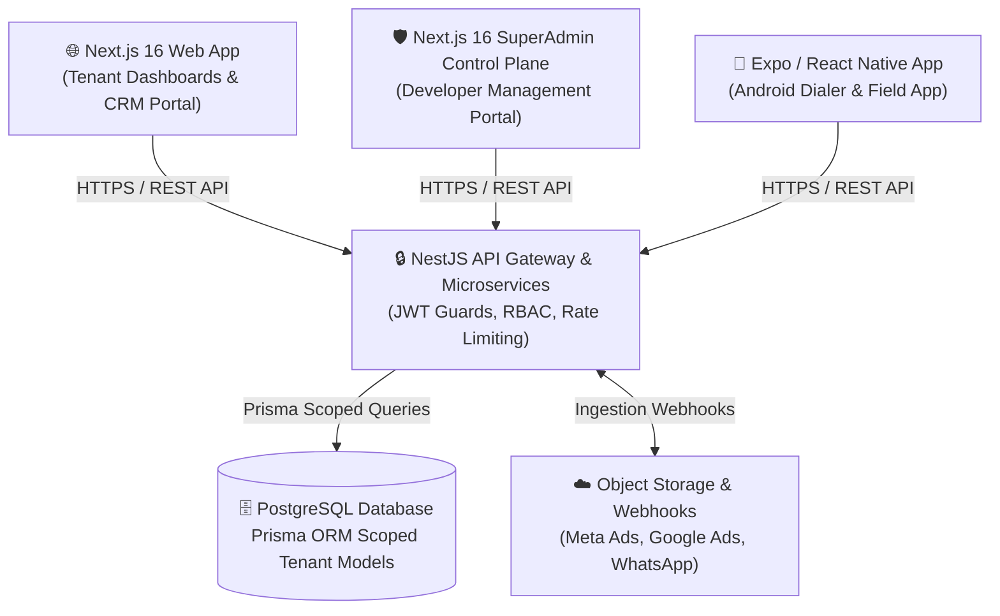

### Component Responsibility Matrix

| Subsystem | Stack | Primary Responsibilities |
| :--- | :--- | :--- |
| **Backend API (`/backend`)** | NestJS, TypeScript, Prisma ORM, Passport.js, Argon2/Bcrypt | Central REST API, JWT issuer, RBAC permission engine, lead funnel algorithms, background schedulers. |
| **Tenant Web App (`/frontend-web`)** | Next.js 16 (App Router), React, Tailwind CSS, Lucide | Multi-tenant user portal, lead manager, analytics dashboards, manager team hierarchy controls. |
| **SuperAdmin Web (`/superadmin-web`)** | Next.js 16, Tailwind CSS | Platform Developer Control Plane, tenant company key generator, subscription approval gateway. |
| **Mobile App (`/android`)** | React Native, Expo, WatermelonDB / AsyncStorage | Field agent dialer, native call detection, real-time post-call outcome popups, offline call sync. |

---

## 🔒 Authentication Architecture

### Dual-Entry Security Gateway

NexCRM implements a decoupled, dual-entry security gateway ensuring zero trust isolation between developer control plane administration and tenant business logic:

1. **Developer Control Plane (`SUPER_ADMIN`)**:
   - Access limited exclusively to verified system developer emails configured via `SUPER_ADMIN_EMAIL`.
   - Bypasses tenant registration. Uses 2-Factor One-Time Password (OTP) challenge sent over secure SMTP.
   - Produces a distinct `SuperAdmin` JWT payload containing global platform clearance.

2. **Tenant Workspace Portal (`OWNER`, `ADMIN`, `HR`, `MANAGER`, `TEAM_LEADER`, `SALES`, etc.)**:
   - Organization-scoped authentication via Email/Password, Company Activation Keys, or Google OAuth 2.0.
   - Enforces company key validation during tenant onboarding to automatically map initial registration to `PlanTier` quotas.

### 🏛️ Company Workspace 4-Tier Authentication & Authorization Structure

Company workspace login enforces a strict 4-stage verification pipeline for both Standard Password and Google OAuth authentication modes:

```
Company Name Select  --------> Verify in select Company Database
Key Input            --------> Verify Status (Active/Not Active), Plan (Free/Paid) & allocate features
Email Input          --------> Verify User Role & Responsibilities, Activity Status & Data Isolation Scoping
Password / Google    --------> Standard: Verify Password Hash. Google OAuth: Email verified by Google -> Password Not Required
```

| Login Step | Verification Action & Scope |
| :--- | :--- |
| **1. Company Name Select** | Verifies selected company workspace in Company Database (`organizationId`) and ensures active status. |
| **2. Key Input** | Validates Registration or Invite Key status (`ACTIVE`), subscription plan tier (`FREE_TRIAL` vs `PRO`/`ENTERPRISE`), and allocates feature permissions (WhatsApp, Email Automation, Seat Limits). |
| **3. Email Input** | Verifies email address, user activity status (`isActive`), and loads assigned role & responsibilities (`ADMIN`, `HR`, `MANAGER`, `TEAM_LEADER`, `SALES_EXEC`). Enforces row-level data isolation scoping (e.g. two managers can access only their own team data). |
| **4. Password / Google OAuth** | **Standard Login**: Verifies Bcrypt password hash and grants access.<br/>**Google OAuth Login**: Requires Company & Key selection $\rightarrow$ Email identity verified by Google $\rightarrow$ **Password is NOT required**. Access granted with role & data permissions. |

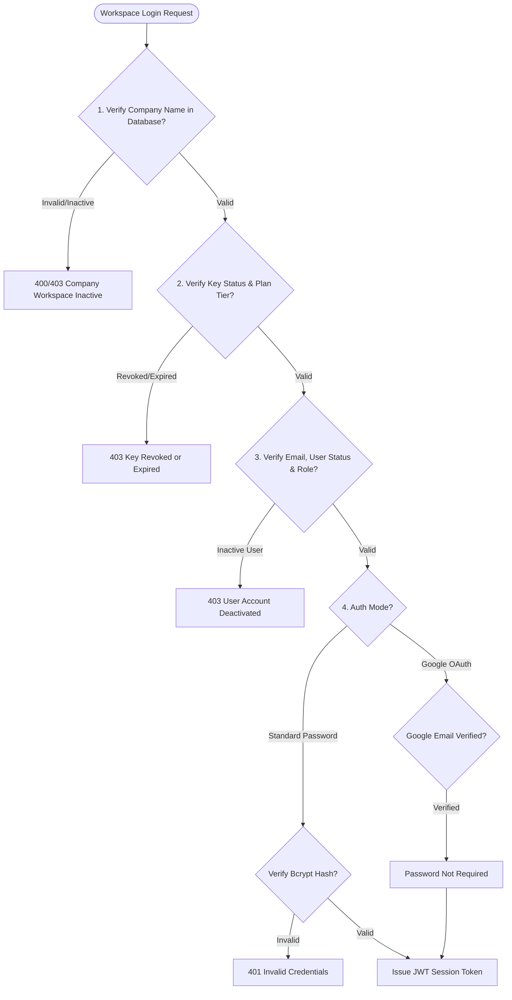

### Auth Protocols & Token Lifecycle

- **Access Token (Short-lived)**: Signed via JWT with `HS256` or `RS256` secret, expiring in **15 minutes to 24 hours** (configurable via `JWT_EXPIRATION`).
- **Token Payload Schema**:
  ```json
  {
    "sub": "usr_98f7a23c14",
    "email": "manager@company.com",
    "org_id": "org_77b21a990a",
    "role": "MANAGER",
    "plan_tier": "PRO",
    "iat": 1771234500,
    "exp": 1771320900
  }
  ```
- **Refresh Token (Long-lived)**: Stored in HTTP-Only, SameSite cookies or secure app device storage, enabling silent token renewal without credential re-entry.

### SuperAdmin Control Plane Auth
- **Endpoint**: `/api/v1/auth/super-admin/request-otp` & `/api/v1/auth/super-admin/verify-otp`
- **Security Logic**:
  - Validates requester against `SUPER_ADMIN_EMAIL` (`adtyamighty@gmail.com`).
  - Generates a cryptographically random 6-digit numeric OTP with 10-minute sliding window expiration.
  - Grants global tenant oversight access upon successful verification.

### Tenant Workspace Auth
- **Endpoint**: `/api/v1/auth/register`, `/api/v1/auth/login`, `/api/v1/auth/google`
- **Key Activation Flow**:
  - Tenant Owner registers with a `CompanyKey` generated by SuperAdmin.
  - System verifies key status (`ACTIVE`). Upon consumption, key flips to `USED`, assigns `organization_id`, provisions default RBAC roles, and locks in `PlanTier` quotas.

---

## 🛡️ Authorization Framework & RBAC

### Role Hierarchy & Matrix

NexCRM employs fine-grained Role-Based Access Control (RBAC) augmented with Attribute-Based Access Control (ABAC) for record ownership.

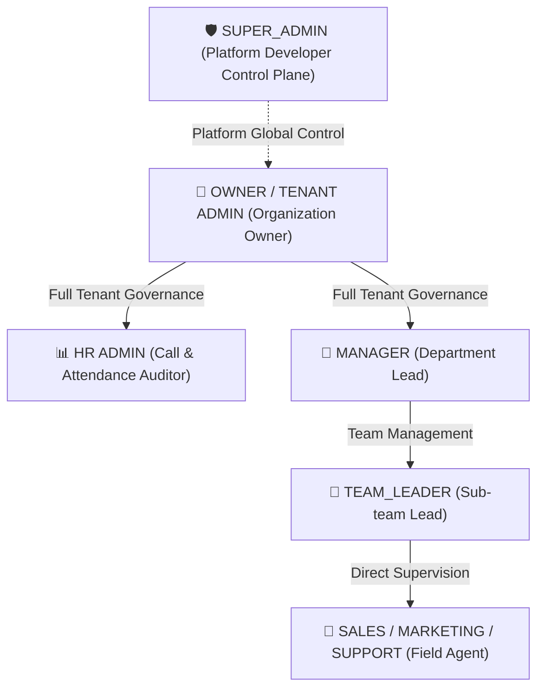

#### Detailed RBAC Permission Matrix

| Role | Scope | Tenant Settings | User Provisioning | Hierarchy Assignment | Lead Funnel Config | View Leads | HR Audit Logs |
| :--- | :---: | :---: | :---: | :---: | :---: | :---: | :---: |
| **`SUPER_ADMIN`** | Platform Global | 🌐 Full | 🌐 System Wide | N/A | 🌐 Override | 🌐 All Tenants | 🌐 All Tenants |
| **`OWNER` / `ADMIN`** | Tenant (`ALL`) | ✅ Full | ✅ Exclusive | ✅ Exclusive | ✅ Full Config | ✅ All Tenant Leads | ✅ Full Tenant Audit |
| **`HR`** | Tenant (`ALL`) | ❌ Read-Only | ❌ Restricted | ❌ Restricted | ❌ View Only | ❌ No Sales Edit | ✅ Full HR & Call Audit |
| **`MANAGER`** | Department (`TEAM`) | ❌ Restricted | ❌ No Create | ❌ No Reassign | 👁️ View Assigned | ✅ Department Leads | 👁️ Department Calls |
| **`TEAM_LEADER`** | Sub-Team (`TEAM`) | ❌ Restricted | ❌ No Create | ❌ No Reassign | 👁️ View Assigned | ✅ Sub-Team Leads | 👁️ Team Calls |
| **`SALES / EXEC`** | Personal (`OWN`) | ❌ None | ❌ None | ❌ None | ❌ None | 🔒 Assigned Only | 🔒 Self Logs Only |

### Tenant Administrator Exclusive Rights

> [!IMPORTANT]
> **Strict Administrative Rule**: ONLY users possessing the `OWNER` or `ADMIN` role within a tenant organization are authorized to:
> 1. Create new Team Leaders (`TEAM_LEADER`) and Employees (`SALES`, `MARKETING`, `SUPPORT`).
> 2. Re-assign or transfer Employees between Managers or Team Leaders.
> 3. Modify organizational team hierarchy configurations.
>
> Managers and Team Leaders CANNOT create user accounts or alter structural reporting nodes.

### Record Scope Scoping (`OWN`, `TEAM`, `ALL`)

Database query enforcement relies on `RecordScope` evaluation in `PermissionsGuard`:

```typescript
// NestJS Permission Guard Evaluation Logic
if (user.role?.name === 'OWNER' || user.role?.name === 'ADMIN') {
  return queryBuilder.where({ organization_id: user.org_id }); // ALL
} else if (user.recordScope === 'TEAM') {
  return queryBuilder.where({
    organization_id: user.org_id,
    team_id: { in: user.managedTeamIds }
  }); // TEAM
} else {
  return queryBuilder.where({
    organization_id: user.org_id,
    assigned_user_id: user.id
  }); // OWN
}
```

### Multi-Tenant Data Isolation Strategy

NexCRM utilizes a **Shared Database, Shared Schema** architecture with **Row-Level Scoping**.
Every tenant-specific table (`users`, `leads`, `call_logs`, `teams`, `tasks`, `products`, `quotations`) contains a mandatory, indexed `organization_id` foreign key.

```sql
-- Enforced Scoping Pattern on Every Database Query
SELECT * FROM "leads"
WHERE "organization_id" = 'org_77b21a990a'
  AND ("assigned_user_id" = 'usr_123' OR "team_id" IN ('team_456'));
```

---

## ⚙️ Core Engine Architectures

### 3-Model Lead Funnel Distribution Engine

NexCRM accommodates diverse sales operational models via three distinct automated lead distribution engines:

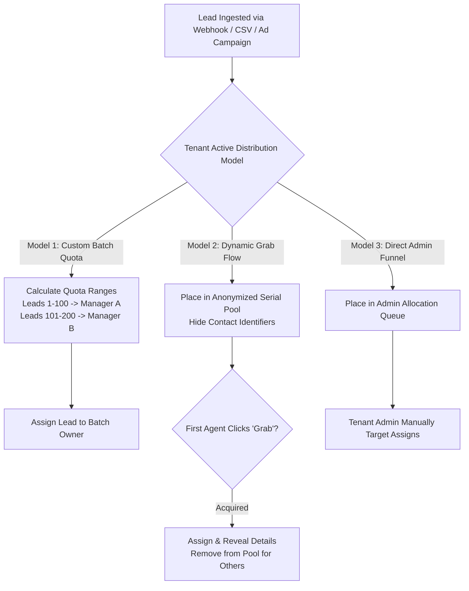

1. **Model 1: Custom Batch Quota Model**:
   - Divides incoming lead volume into numerical ranges (e.g., Leads 1–50 assigned to Team A, Leads 51–100 assigned to Team B).
   - Once a batch quota is fulfilled, the engine shifts to the next active batch.
2. **Model 2: Dynamic "Grab" Pool Flow**:
   - Ingests leads into a shared, anonymized queue. Contact details remain hidden until a sales representative clicks "Grab".
   - The first agent to grab the lead secures exclusive ownership.

---

### 📊 Google Sheets Real-Time Sync Integration Engine

DAS CRM features a native Google Sheets Ingestion & Webhook Sync Engine that connects directly to Google Drive Workbooks, handles Sheet Tab selection, cell address mapping, and 2-step sync verification:

| Config Feature | Description | Example Setup |
|---|---|---|
| **Workbook Selector** | Choose target Google Drive Spreadsheet Workbook | `August_2026_Inbound_Leads.gsheet` |
| **Sheet Tab Selection** | Multi-select active Sheet tabs to sync / exclude | `Inbound_Leads_Sheet1` [ENABLED], `Archived` [EXCLUDED] |
| **Row Offset Control** | Define exact row index where data record sync begins | `Row 2` (Headers at Row 1, Data starts Row 2) |
| **Cell Address Mapping** | Map grid cell column coordinates directly to CRM fields | `A2` $\rightarrow$ Name, `B2` $\rightarrow$ Phone, `C2` $\rightarrow$ Email, `D2` $\rightarrow$ Company |
| **2-Step Sync Verification** | **Step 1**: Open Sheet preview<br/>**Step 2**: Alter cell data & click Verify to confirm test change | `TEST POSITIVE — Change Detected & Verified!` |

   - Any eligible sales representative can view the pool. The first representative to click **"Grab Lead"** atomically acquires ownership (`UPDATE leads SET assigned_user_id = ... WHERE id = ... AND assigned_user_id IS NULL`), instantly removing it from the pool for all other agents.
3. **Model 3: Direct Admin Targeted Funnel**:
   - Bypasses automated allocation. All incoming leads land in the Tenant Admin intake buffer for explicit manual assignment.

### Hybrid Team Hierarchy Engine

NexCRM supports complex enterprise reporting structures:
- **Standard Hierarchy**: Manager $\rightarrow$ Team Leader $\rightarrow$ Employee A
- **Direct Reporting (No TL)**: Manager $\rightarrow$ Employee B (Direct Report)
- **Multi-TL Department**: Manager supervising multiple Team Leaders, each managing discrete agent clusters.

```mermaid
graph TD
    M1[👔 Manager Alpha]
    TL1[🧢 Team Leader 1]
    TL2[🧢 Team Leader 2]
    E1[💼 Agent A (Under TL1)]
    E2[💼 Agent B (Under TL1)]
    E3[💼 Agent C (Direct Report to Manager)]

    M1 --> TL1
    M1 --> TL2
    M1 -->|Direct Report - No TL| E3
    TL1 --> E1
    TL1 --> E2
```

### Post-Call Logger & HR Audit Engine

The mobile dialer application integrates directly with native Android call state listeners:

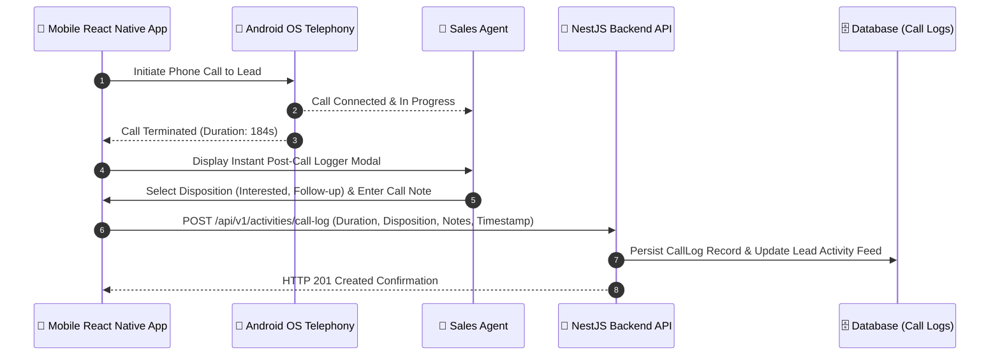

- **HR Call Audit Telemetry**: Real-time aggregation of total daily call volume, successful vs. unsuccessful connections, cumulative talk-time duration, and average call duration per employee.

### 30-Day Free Trial & Subscription Lifecycle

- **Auto-Provisioning**: New organizations start with a 30-day trial under `PlanTier.FREE_TRIAL`.
- **Lockout Enforcement**: At $t > 30\text{ days}$, if no active paid key or subscription is linked, the tenant enters **Expired View-Only Mode**:
  - ❌ Blocked: Creating new leads, sending WhatsApp/Email campaigns, initiating calls, exporting CSVs.
  - 👁️ Allowed: Viewing existing dashboard data and submitting plan upgrade requests.
- **Plan Upgrade Approval Flow**:
  1. Tenant Admin submits a Plan Upgrade Request with payment transaction references.
  2. SuperAdmin approves request in `/superadmin-web`.
  3. System upgrades tenant `PlanTier` to `PRO`, `PRO_50`, or `ENTERPRISE` and unlocks full platform execution.

---

## 🔄 End-to-End Data Flow Diagrams

### 1. Authentication & Session Token Sequence

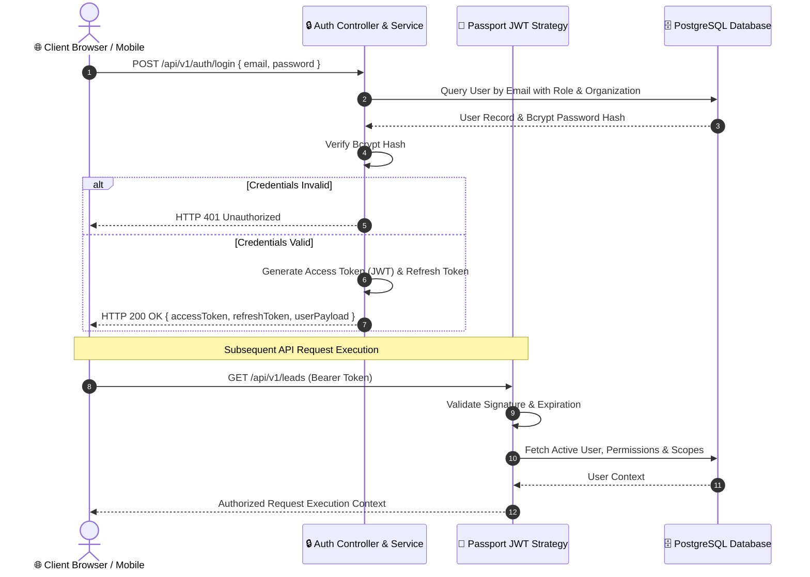

### 2. Multi-Tenant RBAC Guard Scoping Flow

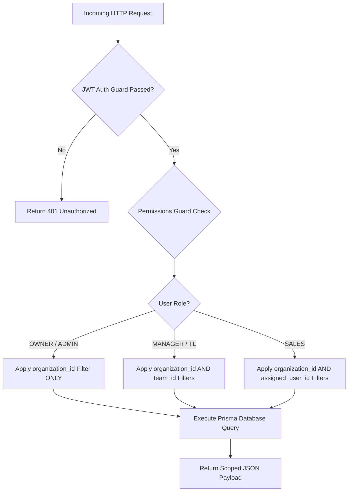

### 3. Lead Ingestion & 3-Model Distribution Flow

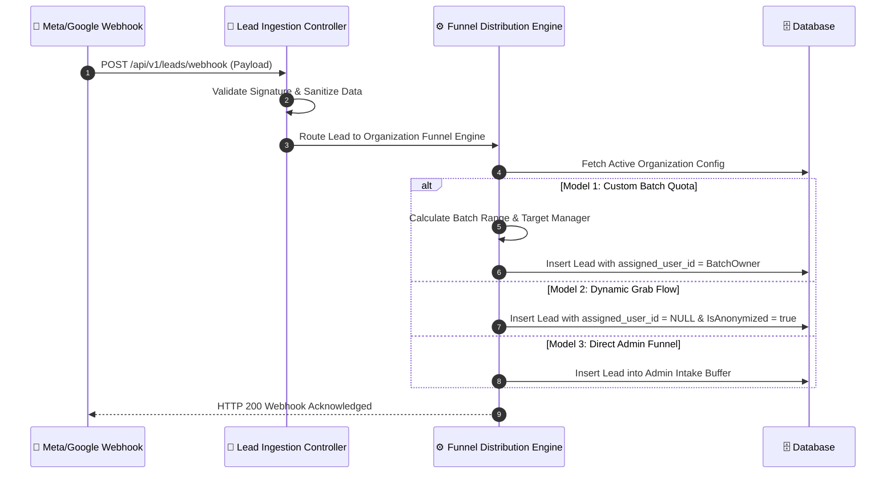

### 4. Post-Call Mobile Logger & HR Audit Flow

```mermaid
flowchart LR
    NativeCall[Native Call Ends on Mobile] --> Detect[Mobile App Call Listener Detects Duration]
    Detect --> Popup[Display Instant Post-Call Modal]
    Popup --> AgentInput[Agent Selects Outcome & Adds Notes]
    AgentInput --> APIPayload[POST /api/v1/activities/call-log]
    APIPayload --> NestAPI[NestJS Activity Controller]
    NestAPI --> DBWrite[Write CallLog & Update Lead Status]
    DBWrite --> HRAudit[Aggregate in HR Audit Analytics Dashboard]
```

### 5. Plan Upgrade & Key Activation Sequence

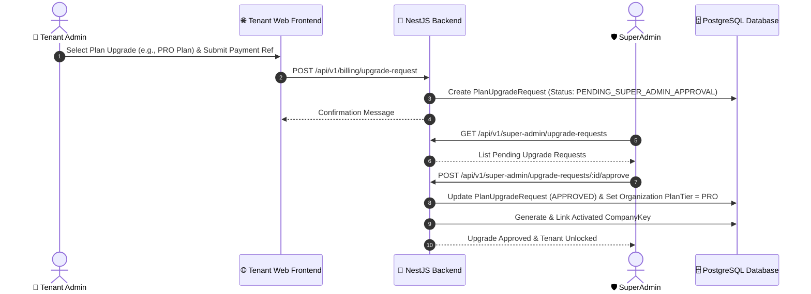

---

## 🗄️ Database Schema & Data Model Topology

NexCRM uses Prisma ORM with PostgreSQL. Key schema entities include:

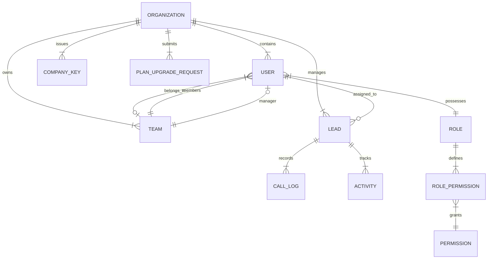

### Core Schema Entity Definitions

- **`Organization`**: Multi-tenant isolation anchor (`id`, `name`, `plan_tier`, `trial_ends_at`, `is_active`).
- **`User`**: User entity (`id`, `organization_id`, `email`, `password_hash`, `role_id`, `team_id`, `reports_to_id`, `is_active`).
- **`Role`**: Custom or system RBAC role (`id`, `organization_id`, `name`, `record_scope`).
- **`Permission`**: Granular resource action mapping (`id`, `resource`, `action`).
- **`Lead`**: CRM core entity (`id`, `organization_id`, `assigned_user_id`, `team_id`, `status`, `funnel_model`, `is_grab_pool`, `custom_fields_json`).
- **`CallLog`**: HR Telemetry audit record (`id`, `organization_id`, `user_id`, `lead_id`, `duration_seconds`, `disposition`, `notes`).
- **`CompanyKey`**: SuperAdmin platform license key (`id`, `key_code`, `plan_tier`, `status`, `organization_id`).

---

## 📁 Repository Structure

```
DAS CRM/
├── backend/                  # NestJS API Backend Service
│   ├── prisma/               # Database Schema, Seeders & Migrations
│   │   ├── schema.prisma     # Multi-Tenant Shared Database Topology
│   │   └── seed.ts           # System Roles & Initial Seed Data
│   └── src/
│       ├── common/           # Shared Guards, Decorators & Filters
│       │   └── guards/       # PermissionsGuard & JWT Guards
│       └── modules/          # Business Feature Modules
│           ├── auth/         # JWT Auth, Google OAuth, OTP & CompanyKey Services
│           ├── leads/        # 3-Model Lead Funnel Distribution Engines
│           ├── hr/           # HR Attendance, Leaves & Call Audit Services
│           ├── teams/        # Hybrid Manager/TL Hierarchy Services
│           └── billing/      # Plan Tier & Subscription Upgrade Logic
│
├── frontend-web/             # Next.js 16 Web App Router (Tenant Portal)
│   ├── app/                  # Role-Based Route Handlers & Dashboards
│   ├── components/           # UI Component Library (Lead Funnels, Call Loggers)
│   └── context/              # AuthContext & Client RBAC Provider
│
├── superadmin-web/           # Next.js 16 SuperAdmin Control Plane
│   └── app/                  # Company Key Generator & Upgrade Approvals
│
├── android/                  # Expo / React Native Mobile App
│   ├── app/                  # Mobile Screens & Dialer Interface
│   └── src/                  # WatermelonDB / Offline Call Sync Engine
│
├── .github/
│   └── workflows/
│       └── ci-cd.yml         # GitHub Actions Automated Build & Packaging Pipeline
│
└── README.md                 # System Architecture & API Documentation
```

---

## 💻 Quick Start & Local Setup

### System Prerequisites
- **Node.js**: `v18.x` or `v20.x` (LTS)
- **Java JDK**: JDK 17 (Required for Android APK Compilation)
- **Database**: PostgreSQL `v14+` (Local instance or Supabase/Neon)

---

### 1. Backend Service Setup (`/backend`)

```bash
# Navigate to backend workspace
cd backend

# Install dependencies
npm install

# Configure Environment Variables
cp .env.example .env
# Ensure DATABASE_URL, JWT_SECRET, and SUPER_ADMIN_EMAIL are set

# Run Prisma Database Migrations & Push Schema
npx prisma db push

# Seed System Roles & Initial Admin Accounts
npx prisma db seed

# Start NestJS API Server in Development Mode
npm run start:dev
```
Backend API will start at: `http://localhost:3000`

---

### 2. Tenant Web App Setup (`/frontend-web`)

```bash
# Navigate to web frontend workspace
cd frontend-web

# Install dependencies
npm install

# Start Next.js Development Server
npm run dev
```
Tenant Web Portal will start at: `http://localhost:3001`

---

### 3. SuperAdmin Control Plane Setup (`/superadmin-web`)

```bash
# Navigate to SuperAdmin workspace
cd superadmin-web

# Install dependencies
npm install

# Start SuperAdmin Next.js Portal
npm run dev
```
SuperAdmin Portal will start at: `http://localhost:3002`

---

### 4. Mobile App Setup (`/android`)

```bash
# Navigate to Android workspace
cd android

# Install JS dependencies
npm install

# Bundle Metro JavaScript Bundle
npx react-native bundle --platform android --dev false --entry-file index.ts --bundle-output android/app/src/main/assets/index.android.bundle

# Compile Release APK locally using Gradle (Requires JDK 17)
cd android
$env:JAVA_HOME='C:\Users\Mighty\.gradle\jdks\eclipse_adoptium-17-amd64-windows.2'
.\gradlew.bat assembleRelease
```
Compiled APK binary located at:  
`android/app/build/outputs/apk/release/app-release.apk`

---

## 🚀 CI/CD & Production Deployment Infrastructure

The monorepo includes automated GitHub Actions integration configured in [`.github/workflows/ci-cd.yml`](file:///.github/workflows/ci-cd.yml).

### Automated Pipeline Jobs
1. **`build-and-test-backend`**: Runs NestJS TypeScript compilation, Prisma schema verification, and unit test suites on Ubuntu runners.
2. **`build-and-test-frontend`**: Validates Next.js static compilation and client build output for both `frontend-web` and `superadmin-web`.
3. **`build-android`**: Provisions JDK 17 & Android SDK, installs Metro dependencies, executes `./gradlew assembleRelease`, and uploads the final downloadable `app-release.apk` workflow artifact.

### Recommended Production Deployment Matrix

| Subsystem | Target Hosting Platform | Deployment Strategy |
| :--- | :--- | :--- |
| **Tenant Web (`frontend-web`)** | **Vercel** | Edge-rendered Next.js Serverless App |
| **SuperAdmin Web (`superadmin-web`)** | **Vercel** | Isolated Next.js Administration App |
| **Backend API (`backend`)** | **Render** / **Railway** | Docker Containerized NestJS Instance |
| **Database** | **Supabase** / **Neon Tech** | Serverless Managed PostgreSQL Database |
| **Mobile App (`android`)** | **Expo EAS Build** | Automated Play Store AAB / APK Distribution |

---

## 📱 Multi-Device Responsiveness Architecture

DAS CRM and SuperAdmin Control Plane apps are engineered with full responsiveness across 7 device viewport tiers, preserving all colors, aesthetic styles, dark themes, and typography.

### Responsive Breakpoints Matrix

| Device Category | Viewport Width | Suggested Breakpoint | Applied Layout Behavior |
| :--- | :---: | :---: | :--- |
| 📱 **Small phones** | 320–374 px | `< 576px` | 1-column KPI grid cards, mobile hamburger menu header toggle, slide-in overlay drawer navigation with backdrop, full-bleed scrollable data tables, modal dialog auto-fit with max-height scrolling (`max-h-[90vh]`). |
| 📱 **Large phones** | 375–767 px | `576–767px` | 2-column KPI grids, wrapped action toolbars, responsive search trigger. |
| 📱 **Tablets** | 768–1023 px | `768–1023px` | 2-to-3 column grids, touch-friendly drawer navigation. |
| 💻 **Small laptops** | 1024–1279 px | `1024–1279px` | Fixed `260px` sidebar layout (`lg:ml-[260px]`), 3-to-4 column KPI grids, inline desktop search bar. |
| 💻 **Laptops** | 1280–1439 px | `1280–1439px` | 4-to-6 column KPI grids, expanded multi-column tables. |
| 🖥️ **Desktop** | 1440–1919 px | `1440–1919px` | Multi-column telemetry dashboard layout. |
| 🖥️ **Large desktop** | 1920px+ | `1920px+` | Centered layout container scaling (`2xl:max-w-[1920px]`). |

---

## 📄 Binary Excel Ingestion & Email Sanitization Engine

The client-side Excel Ingestion Engine in `TenantAdminDashboard` supports `.xlsx`, `.xls`, and `.csv` files:

1. **Email Column Sanitization**:
   - Empty/missing email cells or generic placeholder strings like `lead@organization.com` are converted to **`"No Email Provided"`**.
   - Rendered in the Live Directory as a clean styled badge (`No Email Provided`) instead of leaving the Email column blank.

2. **Data Matrix Telemetry Audit**:
   - Dynamically calculates the exact count of Excel rows containing data and maximum columns with data.
   - Post-import modal displays:
     - **Excel Rows (With Data)**: e.g., `8 Rows`
     - **Excel Columns (With Data)**: e.g., `8 Columns`

---

> Built with precision for high-scale enterprise CRM operations.
